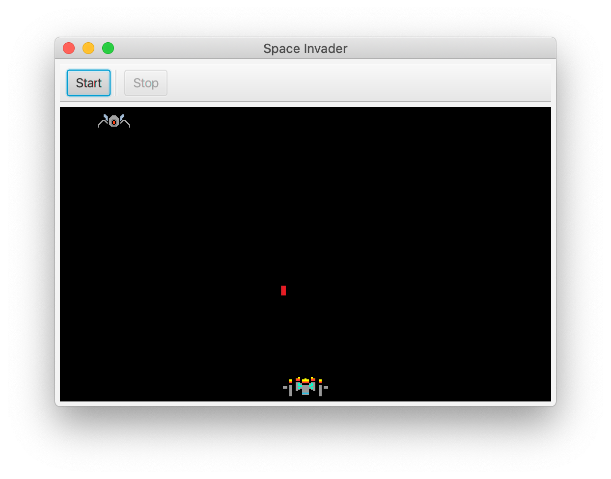
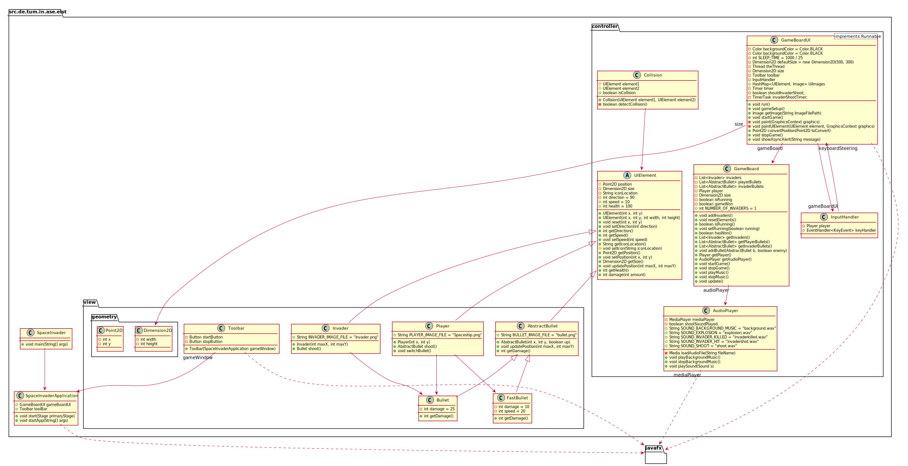

# 👾 Space Invader

A clone of Space Invaders, where only a single invader reached earth.

This should make things much easier ✨🍰✨.

## Getting Started

* Launch the application
* Click `Start` (or hit `Space`) to start the game
* Move your spaceship using `j` and `k`, shoot with `f`, change weapon with `d`

## Known Issues

* Pressing Stop and Start will make Player unresponsive for left and right movement
  * Workaround: Restart game after every rund. Do not use the `Stop` button.
* FPS drops when shooting the first few bullets.
  * Workaround: None. Make sure you are clear of any danger 😉
* Exiting the game will sometimes not exit the application.
  * Workaround: Kill the application using `CTRL`+`C`
* Keeping `j` pressed will freeze the GameBoard.
  * No automatic gun fire. Keep it clean!

## Diagrams

*Note: Some references have been left out to make the diagram more understandable (e.g. any references into the `view.geometry` package)*

## Testing

See [Testing Documentation](./Testing.md) for more information.
